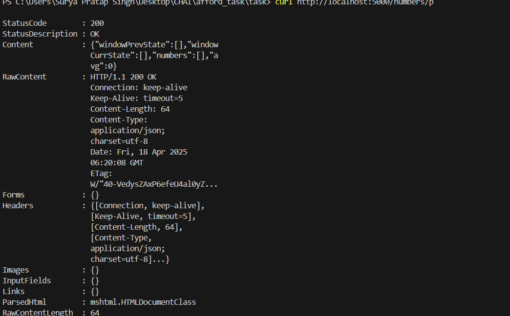
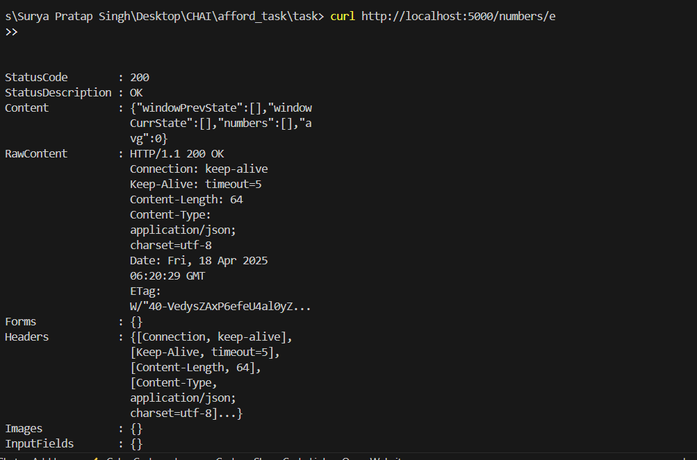

# Calculator Microservice

This is a simple Node.js microservice that calculates the average of a sliding window of numbers.  
It fetches different types of numbers from external APIs (prime, Fibonacci, even, and random), and keeps track of the last 10 unique numbers.

---

## 📷 Screenshot

---

Start the Server- 

node index.js
